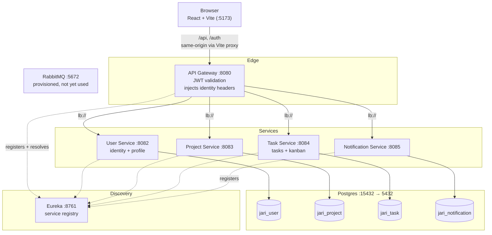

# Jari - Jira Clone Microservices Architecture

A Jira-style project management system: projects, issues, and a drag-and-drop Kanban board, built as six Spring Boot microservices behind a Spring Cloud Gateway with a React + Vite frontend.

Built as a **learning project for distributed-systems patterns** — service discovery, gateway-centralised authentication, identity propagation across service boundaries, and database-per-service. Not aimed at production; several defects are deliberately left in place until their planned phase.

- [`spec.md`](spec.md) — behavioural contract, API surface, deployment constraints, and known gaps. **Read the deployment constraints before running this anywhere but localhost.**
- [`AGENTS.md`](AGENTS.md) — contributor and AI-agent conventions.

## Architecture

Every browser request enters through the API Gateway, which is the only ingress. The gateway validates the JWT, then injects trusted identity headers (`X-Jari-User-Id`, `X-Jari-Username`) into the forwarded request. Downstream services resolve each other by name through Eureka, and each owns its own Postgres database — no service reads another's tables.



Dashed lines are Eureka registration and lookup; solid lines are request or query paths. RabbitMQ is drawn detached on purpose — it runs in `docker-compose.yml` but no service declares an AMQP dependency yet.

| Service | Port | Responsibility | Database |
|---|---|---|---|
| Eureka Discovery | 8761 | Service registry; dashboard at `http://localhost:8761` | — |
| API Gateway | 8080 | Sole ingress; routes by service name via `lb://`, validates JWTs, injects identity headers | — |
| User Service | 8082 | Identity: registration, login, JWT issuance, profile CRUD | `jari_user` |
| Project Service | 8083 | Project CRUD | `jari_project` |
| Task Service | 8084 | Task/issue CRUD and the Kanban board | `jari_task` |
| Notification Service | 8085 | Notification CRUD | `jari_notification` |

Two shared modules, each depended on only by the services that need it:

- **`jari-common`** — shared DTOs (`BaseDto`, `ResponseDto`, `ErrorResponseDto`), common exceptions and handlers. Used by all services; a known coupling point, deliberately not eliminated.
- **`jari-security`** — JWT handling (`JwtUtils`), gateway-injected identity header names (`IdentityHeaders`), and the filter downstream services use to require them (`IdentityHeaderFilter`).

There used to be a separate Auth Service; it was merged into User Service because the two-table split was an accident, not a real boundary, and it made a user's own id unresolvable from a token.

## Project Structure

```
jari/
├── pom.xml                          # Parent POM
├── docker-compose.yml               # Postgres, RabbitMQ, and all six services
├── Dockerfile                       # Multi-stage Dockerfile
├── postgres/init-db.sql             # Creates the four per-service databases
├── jari-common/                     # Shared DTOs and exception handling
├── jari-security/                   # Shared JWT + identity-header module
├── jari-test-support/               # Shared Testcontainers base classes (test-scoped)
├── jari-discovery/                  # Eureka Discovery Service
├── jari-gateway/                    # API Gateway
├── jari-user-service/               # Identity + User Service
├── jari-project-service/            # Project Service
├── jari-task-service/               # Task Service
├── jari-notification-service/       # Notification Service
└── jari-frontend/                   # React + Vite client
```

## Technology Stack

**Backend**
- Java 21 · Maven (multi-module)
- Spring Boot 3.2.4 · Spring Cloud 2023.0.1 · Spring Cloud Gateway (WebFlux) · Netflix Eureka
- Spring Data JPA · Flyway 9.22.3 (`ddl-auto: validate` — entity drift fails startup)
- PostgreSQL 18 · Lombok 1.18.40 · Docker Compose
- Testcontainers 1.21.3 (integration tests, real Postgres per run)

**Frontend**
- React 19 · TypeScript 5.9 · Vite 8 · Bun
- Tailwind CSS v4 · TanStack Query v5 · Axios
- TipTap 3 (rich-text editor) · Phosphor Icons · ESLint 9

**Provisioned but unused**
- RabbitMQ 3 — runs in `docker-compose.yml` for a planned `TaskAssigned` event; no module declares an AMQP dependency yet.

## Getting Started

Requires **Java 21**, **Maven 3.6+**, **Docker + Docker Compose**, and **Bun** (frontend).

### 1. Start the backend

```bash
docker compose up --build
```

Starts Postgres, RabbitMQ, and all six services in dependency order (Postgres/RabbitMQ healthy → Eureka healthy → gateway and app services). Add `-d` to run detached.

**The first build takes several minutes.** The Dockerfile does not cache Maven dependencies across stages, so each service resolves its own from scratch: roughly 3-6 minutes once `maven:3.9-eclipse-temurin-21` is pulled, plus a few more on the very first run for that ~700MB base image. A build sitting at "load build context" or "RUN mvn clean package" is working, not hung.

**If the build fails**, retry once before investigating. BuildKit's `bake` mode builds all service images concurrently and Maven Central occasionally rejects one of the simultaneous dependency-resolution requests under that load — observed to be transient.

**After restarting a single service**, requests routed to it can return a transient `503` for up to ~30 seconds while the gateway's Eureka registry cache catches up. Not a defect; retry.

### 2. Start the frontend

```bash
cd jari-frontend
bun install
bun run dev
```

Open http://localhost:5173 and sign in with the seeded `admin` / `admin123` (or `user` / `user123`).

On a fresh database there are zero projects, so you land on a "Create your first project" screen. From there the board is a working issue tracker: create issues, edit them in a modal, drag cards between and within columns (optimistic, reverts on failure), and filter by text, assignee, type, or "only my issues". Every drag operation has a non-drag equivalent, so nothing requires a pointer.

Verify the stack end-to-end with the smoke test in [`spec.md`](spec.md#local-verification).

### Local development without Docker

Requires a local Postgres and RabbitMQ (or point `application.yml` at remote ones).

```bash
mvn clean install
```

Start in dependency order: `jari-discovery` → `jari-gateway` → `jari-user-service` → the rest, each via `mvn spring-boot:run` in its module directory. `jari-gateway` and `jari-user-service` need `JARI_SECURITY_JWT_SECRET` set — both fail to start without it, by design.

### Useful commands

```bash
docker compose down -v     # wipe Postgres volume; next `up` re-runs postgres/init-db.sql
docker compose ps          # check for a service stuck in a restart loop
```

### Schema migrations

Each service owns its schema via Flyway (`src/main/resources/db/migration`), applied at startup with `ddl-auto: validate` — entity drift fails startup instead of silently altering tables.

- **Forward-only:** never edit an applied migration; add `V2__...sql`, `V3__...sql`, etc.
- **Reset:** `docker compose down -v` wipes the volume; the next `up` re-applies every migration from `V1`.

### Running the tests

```bash
mvn test      # unit tests (*Test) - no container runtime needed
mvn verify    # + integration tests (*IT) - needs Docker
```

`*IT` classes (Failsafe) spin up a real Postgres via Testcontainers and run the service's own Flyway migrations — a broken migration fails `mvn verify`, not just a real boot.

Known environment hazards:
- **Postgres 18 rejects some JVM timezone aliases** (`Asia/Saigon` fails). Already pinned to UTC in the parent `pom.xml`.
- **A second Postgres on port 5432** causes auth errors against the wrong server. Testcontainers uses random ports, so it's immune.
- **Docker Desktop on Windows** can reject Testcontainers' negotiated API version (`Could not find a valid Docker environment` despite `docker ps` working). `-Dapi.version=1.41` is already pinned in the parent `pom.xml`; also point `DOCKER_HOST` at a reachable endpoint — enable Docker Desktop's `tcp://localhost:2375` (Settings → General → "Expose daemon..."), restart it (`docker desktop restart`), then `DOCKER_HOST=tcp://localhost:2375 mvn verify`.

### Connecting a database client

Postgres is on host port **15432**, not 5432 (`localhost` / `postgres` / `postgres`; databases `jari_user`, `jari_project`, `jari_task`, `jari_notification`).

Non-standard on purpose: a native Postgres on 5432 won't fail loudly, it'll silently route to the wrong server. Verify the mapping with `docker inspect jari-postgres --format '{{json .NetworkSettings.Ports}}'`.

## License

This project is for educational purposes.
